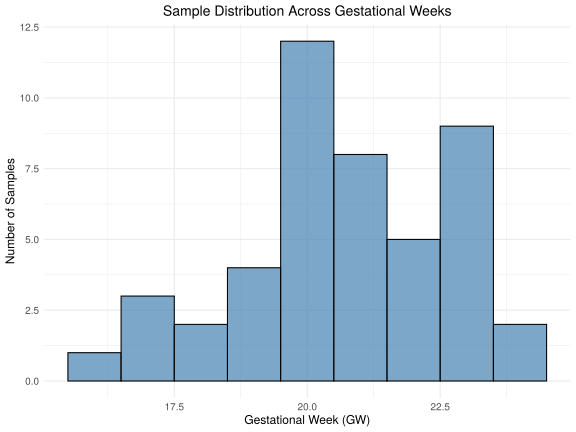

## Goals

Test whether sample-level covariates predict pseudobulk gene expression at the whole-transcriptome level. Results justify covariate inclusion in downstream limma-voom hormone \~ gene models.

**Covariates tested:**

::: incremental
-   **Gestational Week (GW)**
-   **Cell Count** — investigated as sample covariate and confounder
-   **Sex (XX / XY)**
-   **Batch** — investigated as potential technical confound
:::

## Set Up

-   Load packages

    ```{r}
    #| label: load-packages
    #| output: false
    Packages <- c(
      "tidyverse", "Seurat", "Signac", "glue", "readxl", "cowplot",
      "edgeR", "limma", "patchwork", "svglite", "Matrix", "ggpubr"
    )
    lapply(Packages, library, character.only = TRUE)

    source("pseudobulk_functions.R")

    set.seed(123)
    ```

-   Load data

    ```{r}
    #| label: load-cached-data
    pb_base <- readRDS("../../data/cache/pb_base.rds")
    batch_props_sample <- readRDS("../../data/cache/batch_props_sample.rds")
    ```

    ```{r}
    #| label: load-metadata
    targeted_comparison_raw <- read_xlsx("../../doc/targeted/targeted_hormones.xlsx")

    targeted_comparison_raw$TT <- targeted_comparison_raw$`TT (ng/mL)`
    targeted_comparison_raw$P4 <- targeted_comparison_raw$`P4 (ng/mL)`
    targeted_comparison_raw$E2 <- targeted_comparison_raw$`17B-E2 (ng/mL)`
    ```

-   Generate pseudobulk *(min 30 cells per cell type for a sample to be included)*

    ```{r}
    #| label: set-variables
    celltype_col <- "celltype"
    sample_col <- "Sample"
    pb_sample_pattern <- "tissue\\d+"
    ```

    ```{r}
    #| label: build-pseudobulk
    pb_total <- merge_hormone_metadata(
      pb_base,
      targeted_comparison_raw,
      pb_sample_pattern = pb_sample_pattern,
      min_cells         = 30
    )
    ```

-   Compute per-sample batch composition *(used in Batch section)*

    ```{r}
    #| label: batch-props
    # Join batch1_frac onto pb_total$metadata for use in perform_regression()
    pb_total$metadata <- pb_total$metadata %>%
      tibble::rownames_to_column("pseudobulk_id") %>%
      dplyr::left_join(batch_props_sample,
    by           = c("sample_id" = "Sample"),
    relationship = "many-to-one"
      ) %>%
      tibble::column_to_rownames("pseudobulk_id")
    ```

## Gestational Week



Does gestational week predict pseudobulk gene expression?

```{r}
#| label: gw-regression
# GW is numeric (integer gestational weeks) from the hormone Excel file.
# Verify class before running; coerce if needed.
cat(
  "GW class:", class(pb_total$metadata$GW),
  "| range:", paste(range(pb_total$metadata$GW, na.rm = TRUE), collapse = "-"), "\n"
)

results_gw <- perform_regression(pb_total, "GW", "Gestational Week")
summarize_regression_results(results_gw, "Gestational Week", alpha = 0.10)

write.csv(
  results_gw,
  "../../results/gene-hormone/covariate_analysis/results_gw_regression.csv",
  row.names = FALSE
)
```

::: panel-tabset
### Diagnostic Plots

```{r}
#| label: gw-summary-plot
#| fig-width: 10
#| fig-height: 7
plot_covariate_summary(
  results_gw,
  covariate_label = "Gestational Week",
  alpha           = 0.10,
  output_dir      = "../../results/gene-hormone/covariate_analysis",
  filename_base   = "GW_regression_summary"
)
```

### Top Genes

```{r}
#| label: gw-top-genes
#| fig-width: 12
#| fig-height: 8
plot_top_genes_continuous(
  pb_total,
  results         = results_gw,
  covariate       = "GW",
  covariate_label = "Gestational Week",
  n_genes         = 6,
  output_dir      = "../../results/gene-hormone/covariate_analysis",
  filename_base   = "GW_top_genes"
)
```
:::

## Cell Count

Does the number of cells aggregated per pseudobulk sample predict gene expression?

::: smallest
Note that `pb_total$logcounts` is log1p of raw summed counts with no library size normalization, so some association with cell_count is expected by construction and does not indicate a meaningful biological or technical effect — voom handles depth normalization internally.
:::

Does cell_count correlate with hormone expression or GW, making it a confound in the limma models?

::: smallest
Confounding requires correlation with both the outcome (gene expression) and the predictor (hormone/GW).
:::

```{r}
#| label: cc-regression
results_cc <- perform_regression(pb_total, "cell_count", "Cell Count")
summarize_regression_results(results_cc, "Cell Count", alpha = 0.10)

write.csv(
  results_cc,
  "../../results/gene-hormone/covariate_analysis/results_cellcount_regression.csv",
  row.names = FALSE
)
```

```{r}
#| label: cc-hormone-correlation
cor(
  pb_total$metadata[, c("cell_count", "GW", "TT", "E2", "P4")],
  use = "pairwise.complete.obs"
) %>% round(2)
```

::: fragment
**Conclusion:** All correlations between `cell_count` and hormone/GW variables are negligible (\|r\| ≤ 0.02). Cell count is not a confound and will **not** be included as a covariate in limma-voom models. Depth normalization is handled internally by voom.
:::

::: panel-tabset
### Diagnostic Plots

```{r}
#| label: cc-summary-plot
#| fig-width: 10
#| fig-height: 7
plot_covariate_summary(
  results_cc,
  covariate_label = "Cell Count",
  alpha           = 0.10,
  output_dir      = "../../results/gene-hormone/covariate_analysis",
  filename_base   = "CellCount_regression_summary"
)
```

### Top Genes

```{r}
#| label: cc-top-genes
#| fig-width: 12
#| fig-height: 8
plot_top_genes_continuous(
  pb_total,
  results         = results_cc,
  covariate       = "cell_count",
  covariate_label = "Cell Count",
  n_genes         = 6,
  output_dir      = "../../results/gene-hormone/covariate_analysis",
  filename_base   = "CellCount_top_genes"
)
```
:::

## Sex

Does biological sex (XX / XY) predict pseudobulk gene expression?

::: smallest
Reference level: `F` (XX). Positive estimates indicate higher expression in XY samples.
:::

```{r}
#| label: sex-regression
results_sex <- perform_regression(pb_total, "Sex", "Sex")
summarize_regression_results(results_sex, "Sex", alpha = 0.10)

write.csv(
  results_sex,
  "../../results/gene-hormone/covariate_analysis/results_sex_regression.csv",
  row.names = FALSE
)
```

::: panel-tabset
### Diagnostic Plots

```{r}
#| label: sex-summary-plot
#| fig-width: 10
#| fig-height: 7
plot_covariate_summary(
  results_sex,
  covariate_label = "Sex",
  alpha           = 0.10,
  output_dir      = "../../results/gene-hormone/covariate_analysis",
  filename_base   = "Sex_regression_summary"
)
```

### Top Genes

```{r}
#| label: sex-top-genes
#| fig-width: 12
#| fig-height: 8
plot_top_genes_categorical(
  pb_total,
  results         = results_sex,
  covariate       = "Sex",
  covariate_label = "Sex",
  n_genes         = 6,
  output_dir      = "../../results/gene-hormone/covariate_analysis",
  filename_base   = "Sex_top_genes"
)
```
:::

## Batch

Batch is labeled at the **cell level** in `@meta.data$batch` ("batch1" / "batch2"). The same biological samples contributed cells to both batches, so no single batch label can be assigned to a pseudobulk sample. The variable tested below is the **fraction of batch1 cells** within each pseudobulk sample (`batch1_frac`).

```{r}
#| label: batch-distribution
#| fig-width: 7
#| fig-height: 4
# Visualise batch1_frac across all biological samples
cat("batch1_frac summary:\n")
print(summary(batch_props_sample$batch1_frac))

ggplot(batch_props_sample, aes(x = batch1_frac)) +
  geom_histogram(bins = 30, fill = "steelblue", color = NA, alpha = 0.85) +
  labs(
    title    = "Batch Composition per Biological Sample",
    x        = "Fraction of batch1 cells",
    y        = "Samples"
  ) +
  theme_minimal(base_size = 12)

print(batch_props_sample)
```

The distribution is strongly bimodal — most samples are composed almost entirely of batch1 or batch2 cells, not a genuine mixture. Batch composition is therefore a meaningful variable to assess as a potential covariate and/or confounder.

```{r}
#| label: batch-correlation
# Test whether batch1_frac correlates with biological variables of interest.
# Sex must be numeric for cor(); F=1, M=2 (alphabetical factor order).
batch_cor <- pb_total$metadata %>%
  dplyr::mutate(Sex_numeric = as.integer(factor(Sex))) %>%
  dplyr::select(GW, TT, E2, P4, Sex_numeric, batch1_frac) %>%
  cor(use = "pairwise.complete.obs") %>%
  round(2)

print(batch_cor)
```

::: fragment
**Conclusion (confounder):** `batch1_frac` correlations with all hormone concentrations and gestational week are negligible (\|r\| ≤ 0.04). The largest correlation is -0.14 with P4. Batch composition is effectively orthogonal to the biological variables of interest and is **not** a confounder.
:::

Does `batch1_frac` predict pseudobulk gene expression at the transcriptome-wide level, justifying inclusion as a covariate?

```{r}
#| label: batch1-frac-regression
results_batch1_frac <- perform_regression(pb_total, "batch1_frac", "Batch1 Fraction")
summarize_regression_results(results_batch1_frac, "Batch1 Fraction", alpha = 0.10)

write.csv(
  results_batch1_frac,
  "../../results/gene-hormone/covariate_analysis/results_batch1frac_regression.csv",
  row.names = FALSE
)
```

::: panel-tabset
### Diagnostic Plots

```{r}
#| label: batch1-frac-summary-plot
#| fig-width: 10
#| fig-height: 7
plot_covariate_summary(
  results_batch1_frac,
  covariate_label = "Batch1 Fraction",
  alpha           = 0.10,
  output_dir      = "../../results/gene-hormone/covariate_analysis",
  filename_base   = "Batch1Frac_regression_summary"
)
```

### Top Genes

```{r}
#| label: batch1-frac-top-genes
#| fig-width: 12
#| fig-height: 8
plot_top_genes_continuous(
  pb_total,
  results         = results_batch1_frac,
  covariate       = "batch1_frac",
  covariate_label = "Batch1 Fraction",
  n_genes         = 6,
  output_dir      = "../../results/gene-hormone/covariate_analysis",
  filename_base   = "Batch1Frac_top_genes"
)
```
:::

## Summary

```{r}
#| label: summary-table
covariate_summary <- tibble::tibble(
  Covariate = c("Gestational Week", "Cell Count", "Sex", "Batch1 Fraction"),
  Type = c("Continuous", "Continuous", "Categorical", "Continuous"),
  `Genes Tested` = c(
    nrow(results_gw),
    nrow(results_cc),
    nrow(results_sex),
    nrow(results_batch1_frac)
  ),
  `Sig. (FDR < 0.10)` = c(
    sum(results_gw$adj_p_value < 0.10, na.rm = TRUE),
    sum(results_cc$adj_p_value < 0.10, na.rm = TRUE),
    sum(results_sex$adj_p_value < 0.10, na.rm = TRUE),
    sum(results_batch1_frac$adj_p_value < 0.10, na.rm = TRUE)
  )
) %>%
  dplyr::mutate(
    `% Sig.` = round(100 * `Sig. (FDR < 0.10)` / `Genes Tested`, 1),
    `Median R²` = round(c(
      median(results_gw$r_squared, na.rm = TRUE),
      median(results_cc$r_squared, na.rm = TRUE),
      median(results_sex$r_squared, na.rm = TRUE),
      median(results_batch1_frac$r_squared, na.rm = TRUE)
    ), 4)
  )

knitr::kable(covariate_summary)
```

::: fragment
**Interpretation:** Sample level covariates where a substantial fraction of genes reach FDR \< 0.10 — or where the p-value histogram shows enrichment near 0 — exert transcriptome-wide influence and should be included as additive terms in limma-voom models. Potential confounders such as Batch and Cell Count were assessed separately and determined to not be directly related to variables of interest.
:::
